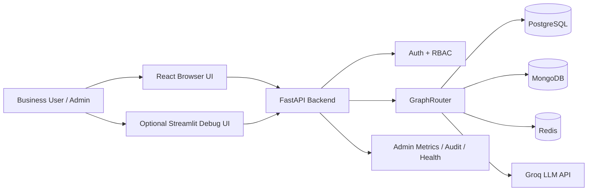
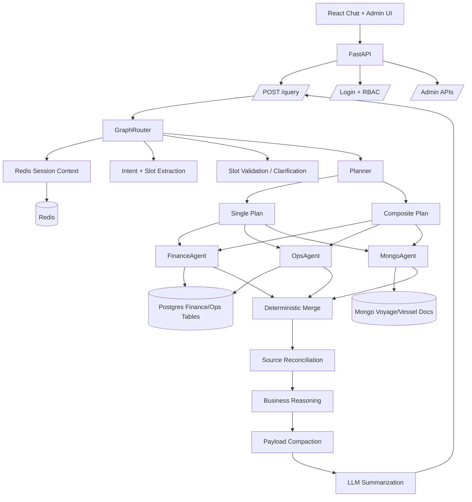
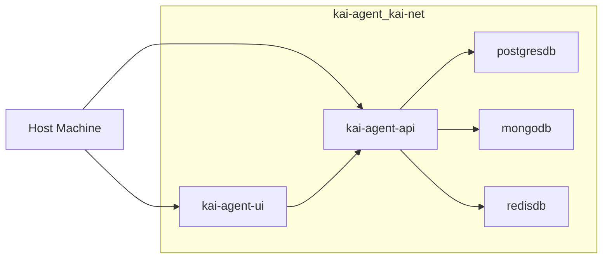

# KAI Agent High-Level Architecture

This HLD describes the current production-oriented architecture after the frontend, RBAC/admin, config-driven refactor, source reconciliation, business reasoning, and golden validation upgrades.

### Functional overview (for decks)

Non-technical system map aligned with this document (people → experience → secure entry → orchestration → planning → evidence → merge → answer, plus guardrails): [`demo-assets/hld-system-map-functional.png`](./demo-assets/hld-system-map-functional.png).

---

## 1. Purpose

KAI Agent is a maritime decision-support assistant. It converts natural-language questions into governed analytics over finance, operations, and document data.

It supports:

- voyage and vessel summaries
- port and cargo analysis
- PnL, revenue, expense, TCE, commission analysis
- delays and offhire analysis
- scenario comparison
- metadata lookups
- business decision questions such as weak revenue conversion, operational risk, and cargo attractiveness

---

## 2. High-Level Goals

The system is designed to:

- answer questions using real data from Postgres and MongoDB
- preserve follow-up context through Redis
- avoid unsafe LLM database access
- support flexible analytics through guarded dynamic SQL/Mongo specs
- keep business/domain logic config-driven
- produce decision-grade responses with reasoning, business impact, and caveats
- expose traceability for demo, debugging, and audit

---

## 3. System Context



---

## 4. Runtime Layers

| Layer | Responsibility | Main files |
| --- | --- | --- |
| Presentation | Chat UI, login, admin dashboard, trace rendering | `frontend/digital-sales-agent-main`, `app/UI/UX/streamlit_app.py` |
| API | Request models, CORS, auth, admin, query endpoint, background side effects | `app/main.py`, `app/auth.py` |
| Orchestration | Session-aware state machine, intent, slots, validation, plan, execution, merge, summarize | `app/orchestration/graph_router.py`, `planner.py` |
| Agents | Domain-specific data retrieval | `finance_agent.py`, `ops_agent.py`, `mongo_agent.py` |
| Data access | Safe database boundaries | `postgres_adapter.py`, `mongo_adapter.py`, `redis_store.py` |
| Guardrails | SQL/Mongo validation and allowlists | `sql_guard.py`, `sql_allowlist.py`, `mongo_guard.py` |
| Configuration | Domain/routing/prompt/business policy | `config/*.yaml`, `app/config/*_loader.py` |
| Intelligence | Reconciliation, derived metrics, reasoning signals, answer contract | `source_reconciliation.py`, `business_reasoning.py`, `response_merger.py` |
| Validation | Unit/regression/golden tests | `tests/`, `scripts/run_golden_config_suite.py` |

---

## 5. Main Component Diagram



---

## 6. User-Facing Flows

### 6.1 Normal Analytical Query

1. User asks a question in React chat.
2. Frontend posts to `POST /query`.
3. FastAPI checks session/request information.
4. `GraphRouter` loads Redis session.
5. Router extracts intent and slots.
6. Router validates required slots.
7. Planner chooses `single` or `composite`.
8. Agents retrieve data.
9. Router merges and enriches results.
10. LLM generates final answer.
11. Frontend renders answer and trace.

### 6.2 Clarification Flow

Example:

`tell me about vesssl`

Flow:

1. Router recognizes incomplete vessel request from config-driven variants.
2. Required vessel identifier is missing.
3. Router returns clarification and suggestions.
4. Redis stores pending clarification context.
5. User replies with a vessel name or number from suggestions.
6. Router resumes the original query with the resolved slot.

### 6.3 Follow-Up Flow

Example:

1. User: "Which voyages have high revenue but weak business quality?"
2. Assistant returns a list.
3. User: "Which one has highest cost ratio?"

Redis stores previous result-set context so the router can interpret the follow-up against the previous answer instead of treating it as a brand-new fleet query.

---

## 7. Data Architecture

### PostgreSQL

Primary structured analytics source.

Key tables:

- `finance_voyage_kpi`
- `ops_voyage_summary`

Used for:

- financial KPIs
- voyage/vessel rankings
- aggregate analytics
- ops enrichment
- delay/offhire context
- cargo/port summaries

Important identity rule:

> Finance and ops joins should prefer `voyage_id`. `voyage_number` is kept for display and user reference.

### MongoDB

Primary rich document and metadata source.

Used for:

- voyage documents
- vessel metadata
- remarks
- fixtures
- route/leg details
- vessel contract/consumption information

### Redis

State and observability source.

Used for:

- session memory
- pending clarification
- result-set follow-up context
- idempotency
- locks
- query metrics
- audit log
- execution history

---

## 8. Config-Driven Design

The current architecture is intentionally config-driven.

| Policy area | Config file |
| --- | --- |
| intents and slots | `intent_registry.yaml` |
| named SQL | `sql_registry.yaml` |
| SQL generation/guardrails | `sql_rules.yaml` |
| routing and follow-ups | `routing_rules.yaml` |
| prompts and answer contract | `prompt_rules.yaml` |
| agent behavior | `agent_rules.yaml` |
| response compaction | `response_rules.yaml` |
| Mongo constraints | `mongo_rules.yaml` |
| business metrics/reasoning/reconciliation | `business_rules.yaml` |

Python code remains generic:

- load config
- execute rules
- validate queries
- run agents
- merge data
- enrich rows
- summarize answers

---

## 9. Decision Intelligence

The current system adds a reasoning layer between retrieval and final response.

### Derived Metrics

Examples:

- `margin`
- `cost_ratio`
- `commission_ratio`

### Business Signals

Examples:

- inefficient revenue
- loss-making result
- delay exposure
- weak business quality
- profitable but operationally risky
- attractive cargo margin

### Source Reconciliation

The system compares identity fields across finance, ops, and Mongo.

It emits:

- alignment status
- severity
- canonical fields
- caveats
- mismatches

### Answer Contract

Analytical answers should explain:

- what happened
- why it matters
- business impact
- data caveats

---

## 10. Security And Safety Boundaries

Important safety rules:

- The LLM never directly queries databases.
- SQL must pass `sql_guard`.
- Mongo specs must pass `mongo_guard`.
- Only read operations are allowed.
- Query limits are enforced.
- Dynamic values should use params, not hardcoded strings.
- RBAC protects admin APIs.
- Request/session ids support traceability and idempotency.

---

## 11. Observability

Every query response can include trace data:

- intent extraction source
- intent key
- slots
- plan type
- agents used
- SQL generated
- row counts
- phases
- token usage estimates
- merge summaries
- dynamic SQL flags

The React UI renders this for admin diagnostics and demo transparency.

---

## 12. Deployment View

Podman app-layer deployment:



Docs:

- `docs/PODMAN_APP_CONTAINERIZATION.md`

Container files:

- `docker/Containerfile.api`
- `docker/Containerfile.ui`
- `docker/podman-compose.app.yaml`
- `docker/app.podman.env.example`

---

## 13. Validation View

Validation layers:

1. Unit tests for loaders, guards, routing, agents, reasoning, reconciliation, merger.
2. Backend regression tests with pytest.
3. Frontend tests with Vitest.
4. Golden query capture/compare using `scripts/run_golden_config_suite.py`.
5. Business decision golden category for reasoning-oriented answers.

Recent backend validation after the business upgrade:

```text
106 passed, 1 warning
```

---

## 14. High-Level Summary

KAI Agent now has a layered architecture:

- React UI for chat/admin/demo.
- FastAPI API for query/auth/admin.
- GraphRouter for orchestration.
- Planner for single/composite execution.
- Agents for finance, ops, and Mongo.
- Guarded adapters for safe DB access.
- YAML configuration for domain behavior.
- Reconciliation and business reasoning for decision-grade answers.
- Golden tests for regression and answer quality.

In one sentence:

> KAI Agent turns natural-language maritime business questions into safe multi-source analytics and produces explainable decision-grade answers with traceability.
