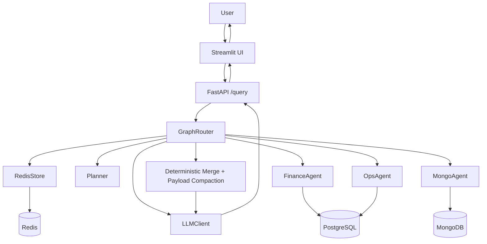
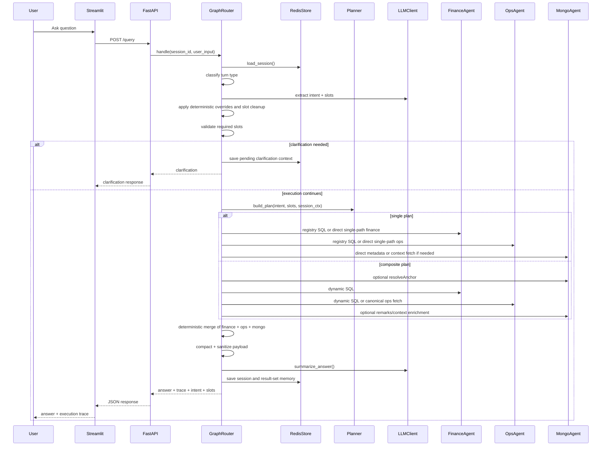

# KAI Agent High-Level Architecture

## Purpose
`kai-agent-amogh-fastapi` is a maritime analytics assistant that answers natural-language questions about:
- voyages
- vessels
- ports
- cargo grades
- PnL, revenue, expense, and TCE
- delays, offhire, and scenario comparisons
- voyage and vessel metadata

The runtime stack combines:
- `PostgreSQL` for structured finance and ops analytics
- `MongoDB` for rich voyage and vessel documents
- `Redis` for session memory and follow-up continuity
- `LLM + deterministic orchestration` for intent extraction, guarded dynamic SQL generation, and final answer drafting

The current system is intentionally hybrid:
- deterministic routing and validation where correctness matters
- registry-driven planning and SQL behavior
- guarded dynamic SQL for fleet-wide analytical questions
- deterministic merge before final narration
- explicit session/result-set persistence for follow-ups

## What Changed In The Updated Architecture
Compared with the earlier version, the implemented flow now explicitly includes:
- turn classification before planning
- clarification follow-up handling through Redis state
- result-set follow-up fast paths such as top/bottom/filter/project actions
- registry-driven `single` vs `composite` planning
- zero-row escalation from misclassified `single` queries into `composite`
- dedicated metadata paths for:
  - `vessel.metadata`
  - `voyage.metadata`
  - `ranking.vessel_metadata`
- deterministic post-answer guards for ranking and cargo-profitability outputs

## Runtime Layers
The runtime is best viewed as five layers:

1. `Presentation layer`
   Streamlit captures user input and renders answers, trace, and SQL.

2. `API layer`
   FastAPI exposes `/query` and `/session/clear`.

3. `Orchestration layer`
   `GraphRouter` manages session loading, turn classification, intent extraction, validation, clarification, planning, execution, merge, summarization, and persistence.

4. `Agent + data access layer`
   `FinanceAgent`, `OpsAgent`, and `MongoAgent` query Postgres and Mongo through adapters.

5. `Storage + memory layer`
   Postgres, MongoDB, and Redis store analytics data, rich documents, and session memory.

## High-Level Component View

## Proper End-to-End Flow

## Request Modes
### Single Mode
Best for:
- one voyage
- one vessel
- one named port
- one metadata request
- one clarification-resolved entity question

Typical examples:
- `voyage.summary`
- `vessel.summary`
- `voyage.metadata`
- `vessel.metadata`

Characteristics:
- fewer steps
- prefers registry SQL and direct Mongo fetches
- lower latency
- lower prompt complexity

### Composite Mode
Best for:
- fleet-wide rankings
- aggregate analytics
- trends
- scenario comparisons
- delayed/offhire analysis
- cross-source finance + ops synthesis

Typical examples:
- `ranking.*`
- `analysis.*`
- `aggregation.*`
- `ops.offhire_ranking`

Characteristics:
- step-based execution plan
- finance dynamic SQL first
- ops enrichment second
- optional Mongo enrichment
- deterministic merge before final answer generation

## Main Runtime Components
### Streamlit UI
Responsibilities:
- keep a stable `session_id`
- send user question to FastAPI
- render answer, clarification, trace, and SQL
- clear backend session state when required

### FastAPI
Responsibilities:
- initialize dependencies
- expose `POST /query`
- expose `POST /session/clear`
- translate request and response models

### GraphRouter
Responsibilities:
- load session context
- classify clarification/follow-up/new-question turns
- extract intent and slots
- validate required slots
- generate clarification messages
- build execution plan
- run `single` or `composite`
- escalate zero-row `single` queries into `composite` when needed
- deterministically merge results
- compact payload for summarization
- persist session and result-set memory
- emit execution trace

### Planner
Responsibilities:
- decide `single` vs `composite`
- build ordered execution steps
- keep entity-anchored questions on `single`
- route registry-declared analytical intents to `composite`
- support forced composite escalation after zero-row single failures

### FinanceAgent
Responsibilities:
- execute finance registry SQL
- generate, repair, and validate finance dynamic SQL
- enforce finance-specific guardrails
- extract voyage ids for downstream composite steps

### OpsAgent
Responsibilities:
- execute ops registry SQL
- fetch canonical ops summaries by voyage id
- run guarded ops dynamic SQL
- enrich rankings with ports, grades, offhire, delays, and remarks fields

### MongoAgent
Responsibilities:
- resolve vessel and voyage anchors
- fetch vessel metadata and voyage metadata
- fetch rich nested voyage context
- support safe dynamic Mongo find for allowed use cases

## Data Stores And Their Roles
### PostgreSQL
Primary structured analytical source.

Key tables:
- `finance_voyage_kpi`
- `ops_voyage_summary`

Used for:
- PnL, revenue, total expense, TCE, commission
- voyage counts, rankings, averages, trends
- delays, offhire, ports, grades, and ops summaries

### MongoDB
Primary document and metadata source.

Used for:
- vessel metadata
- voyage documents
- fixture and leg details
- route context
- nested remarks and projected fields

### Redis
Primary short-term conversation memory.

Used for:
- slots
- last intent
- last user input
- clarification state
- result-set follow-up memory
- selected-row context for follow-ups

## Architecture Decisions
### 1. Registry-first intent contract
`INTENT_REGISTRY` is the semantic contract for supported behavior.

It defines:
- intent meaning
- `single` or `composite`
- required and optional slots
- source dependencies
- SQL hints and guardrails

### 2. Deterministic planning before execution
Planning is not another free-form LLM step.
The planner converts extracted intent and slots into:
- `single`
- `composite`
- ordered execution steps

### 3. Guarded dynamic SQL, not unconstrained SQL generation
Dynamic SQL is allowed only inside a guarded path:
- schema-aware prompt generation
- allowlist checks
- SQL guard validation
- agent-level repair loops and intent-specific safeguards

### 4. Deterministic merge before final narration
The LLM does not invent joins across data sources.
The router assembles normalized merged rows first, then the final answer explains those rows.

### 5. Session memory is explicit and selective
Redis stores:
- slot memory
- result-set memory
- clarification state
- recent focus entity

High-risk entity anchors are cleared when the turn family changes, reducing context bleed.

## Output Strategy
Final answers are generated from a compact merged payload.

The summarizer is guided by:
- strict answer-structure rules
- intent-specific answer archetypes
- markdown/table hygiene rules
- deterministic answer guards for known weak LLM patterns

Current deterministic answer guards include:
- ranking voyage answer repair
- ranking vessel answer repair
- cargo profitability answer repair

## Non-Functional Characteristics
### Strengths
- clear split between orchestration and data access
- support for both entity questions and fleet analytics
- auditable trace with SQL and step metadata
- explicit clarification and follow-up handling
- safer dynamic SQL through layered validation

### Trade-offs
- orchestration logic is concentrated in `GraphRouter`
- dynamic SQL quality still depends on prompt quality plus guardrails
- multiple safety layers increase maintenance cost
- some behavior is intentionally heuristic for robustness

## Recommended Reading Order
1. `app/main.py`
2. `app/orchestration/graph_router.py`
3. `app/orchestration/planner.py`
4. `app/registries/intent_registry.py`
5. `app/agents/finance_agent.py`
6. `app/agents/ops_agent.py`
7. `app/agents/mongo_agent.py`
8. `app/sql/sql_generator.py`
9. `app/sql/sql_guard.py`
10. `app/services/response_merger.py`
11. `app/llm/llm_client.py`

## Summary
The updated architecture is a staged analytics pipeline:
- session-aware routing
- intent and slot extraction
- clarification handling
- deterministic plan generation
- guarded single/composite execution
- deterministic merge
- constrained final narration

It is designed to answer both narrow entity questions and broad analytical prompts while remaining debuggable, traceable, and resilient under multi-turn usage.
