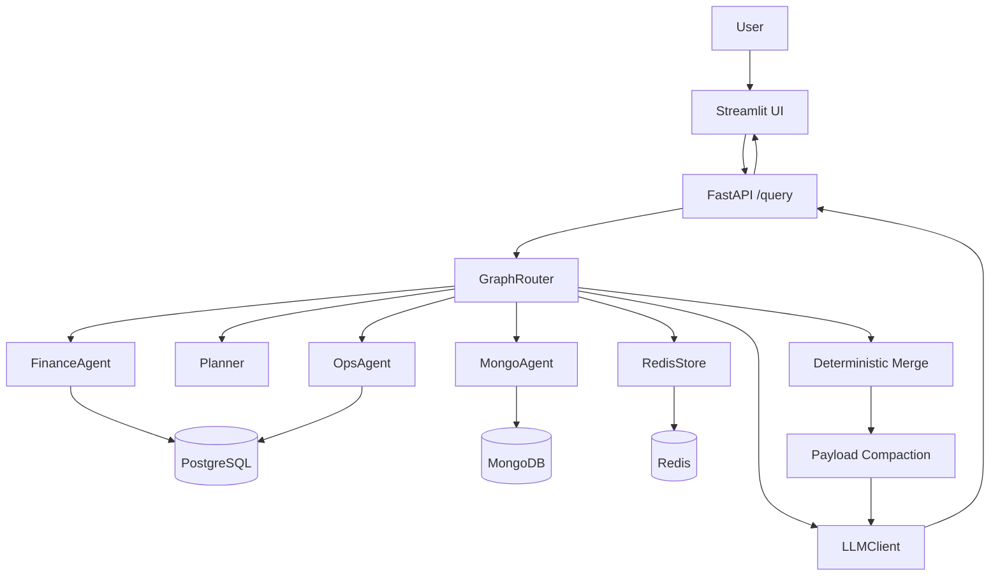
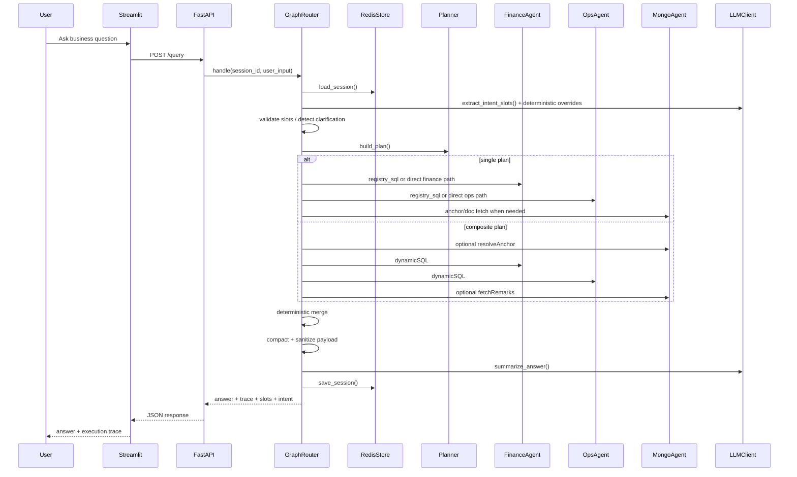

# KAI Agent High-Level Architecture

## Purpose
`kai-agent-amogh-fastapi` is a maritime analytics assistant that answers natural-language questions about voyages, vessels, ports, cargo grades, delays, offhire, remarks, and financial KPIs.

The system combines:
- `PostgreSQL` for structured finance and operations analytics
- `MongoDB` for rich vessel and voyage context
- `Redis` for session memory and follow-up continuity
- `LLM-driven orchestration` for intent extraction, dynamic SQL generation, and final answer drafting

The implemented architecture is designed to balance flexibility with control:
- deterministic routing where possible
- registry-driven intent and SQL behavior
- guarded dynamic SQL for composite analytics
- deterministic merge and post-processing before answer generation

## Primary User Journeys
The application supports two main interaction patterns:

- `Single-entity questions`
  Example: one voyage, one vessel, or one named port
  These typically use registry SQL and/or direct Mongo fetches.

- `Composite analytical questions`
  Example: rankings, trend analysis, profitability comparisons, cargo/port aggregation, scenario comparison
  These typically use a multi-step plan with dynamic SQL plus deterministic merge.

## System Context
At runtime the system is composed of five layers:

1. `Presentation layer`
   Streamlit UI sends requests to the API and renders answers plus execution trace.

2. `API layer`
   FastAPI exposes `/query` and `/session/clear`.

3. `Orchestration layer`
   `GraphRouter` manages session loading, intent extraction, clarification, planning, execution, merge, summarization, and trace capture.

4. `Data access + agent layer`
   Specialized agents interact with Postgres and Mongo through adapters.

5. `Storage + memory layer`
   Postgres, MongoDB, and Redis provide analytics data, rich context, and conversation state respectively.

## High-Level Component View

## End-to-End Request Flow

## Core Architectural Decisions
### 1. Registry-first intent model
`INTENT_REGISTRY` is the central contract for supported behavior.

It defines:
- what each intent means
- whether it is `single` or `composite`
- which slots are required or optional
- which stores are needed
- intent-specific SQL hints and guardrails

This avoids scattering business logic across multiple files.

### 2. Planner separates routing from execution
The planner converts the extracted intent and slots into one of two execution modes:
- `single`
- `composite`

This keeps execution logic stable even as intents grow.

### 3. Agents own domain-specific querying
Each data domain is handled by a dedicated agent:
- `FinanceAgent`
- `OpsAgent`
- `MongoAgent`

This gives each domain its own query rules, safety constraints, and output shape.

### 4. Dynamic SQL is guarded, not free-form
When fixed SQL is not enough, the system generates SQL through:
- schema-aware prompt generation
- allowlist checks
- SQL validation and rewriting
- agent-level repair loops and guardrails

This enables flexible analytics while reducing bad SQL and unsafe patterns.

### 5. Merge is deterministic before final narration
The system does not let the LLM join finance, ops, and Mongo data freely.
Instead, orchestration produces a normalized merged payload first, then the summarizer only explains what is already assembled.

### 6. Session memory is explicit
Redis stores:
- slots
- last intent
- anchors
- result-set memory for follow-up questions

Volatile slots are cleared when intent changes, reducing context bleed across turns.

## Major Runtime Components
### Streamlit UI
Responsibilities:
- capture query input
- keep a stable `session_id`
- call the API
- render final answer
- render execution trace including SQL and step outcomes
- clear Redis session on demand

### FastAPI
Responsibilities:
- initialize dependencies
- expose `/query`
- expose `/session/clear`
- translate request/response models

### GraphRouter
Responsibilities:
- load session context
- classify turn type
- extract intent and slots
- issue clarification when required
- build execution plan
- run single or composite path
- merge results
- compact data for summarization
- call summarizer
- persist updated session
- emit execution trace

### Planner
Responsibilities:
- decide `single` vs `composite`
- define ordered execution steps
- support escalation from misclassified single queries into composite flow

### FinanceAgent
Responsibilities:
- execute finance-focused registry SQL
- generate and repair dynamic finance SQL
- enforce finance-specific guardrails

### OpsAgent
Responsibilities:
- execute ops-focused registry SQL
- fetch canonical ops summaries by voyage id
- support cargo/port/remarks context enrichment
- normalize noisy grade inputs

### MongoAgent
Responsibilities:
- resolve voyage and vessel anchors
- fetch rich voyage/vessel context
- support safe dynamic Mongo find for selected use cases

## Data Stores and Their Roles
### PostgreSQL
Primary analytical source.

Key tables:
- `finance_voyage_kpi`
- `ops_voyage_summary`

Used for:
- revenue, expense, pnl, tce, commission
- voyage counts, ranking, averages, aggregates
- ops summaries such as ports, grades, offhire, delays

### MongoDB
Primary document/context source.

Used for:
- vessel metadata
- voyage documents
- fixtures
- legs
- remarks
- rich nested operational context

### Redis
Primary short-term conversation memory.

Used for:
- session state
- follow-up continuity
- clarification state
- result-set memory
- session cache clearing

## Execution Modes
### Single Plan
Best for:
- one voyage
- one vessel
- one port
- one metadata request

Characteristics:
- fewer steps
- prefers registry SQL or direct document fetch
- lower latency
- lower prompt complexity

### Composite Plan
Best for:
- top-N rankings
- comparisons
- trend questions
- fleet-wide aggregates
- cross-domain finance + ops synthesis

Characteristics:
- multiple steps
- dynamic SQL more likely
- deterministic merge required
- richer execution trace

## Output Strategy
Final user responses are generated from a compact merged payload.

The summarizer is guided by:
- strict answer-format rules
- intent-specific answer archetypes
- table hygiene rules
- ambiguity handling rules
- deterministic post-processing for some known weak patterns

This architecture aims to produce responses that are:
- fact-grounded
- presentation-ready
- traceable back to data sources

## Non-Functional Characteristics
### Strengths
- clear separation between orchestration and data access
- flexible support for both narrow and analytical questions
- auditable execution trace
- session-aware follow-up handling
- guarded dynamic SQL rather than unrestricted generation

### Trade-offs
- orchestration logic is concentrated in `GraphRouter`, which increases file size and complexity
- dynamic SQL quality still depends on prompt quality and guardrails
- multiple safety layers increase code volume and maintenance effort
- some behavior is intentionally heuristic to improve demo-time robustness

## Recommended Reading Order
To understand the system quickly:

1. `app/main.py`
2. `app/orchestration/graph_router.py`
3. `app/orchestration/planner.py`
4. `app/registries/intent_registry.py`
5. `app/agents/finance_agent.py`
6. `app/agents/ops_agent.py`
7. `app/agents/mongo_agent.py`
8. `app/adapters/postgres_adapter.py`
9. `app/services/response_merger.py`
10. `app/llm/llm_client.py`

## Summary
The implemented architecture is a hybrid of:
- deterministic orchestration
- registry-driven intent behavior
- guarded LLM-assisted query generation
- multi-source data fusion
- session-aware conversational analytics

It is optimized for a maritime analytics assistant that must answer both straightforward entity questions and complex business-analysis prompts while remaining explainable enough for demo and debugging.
