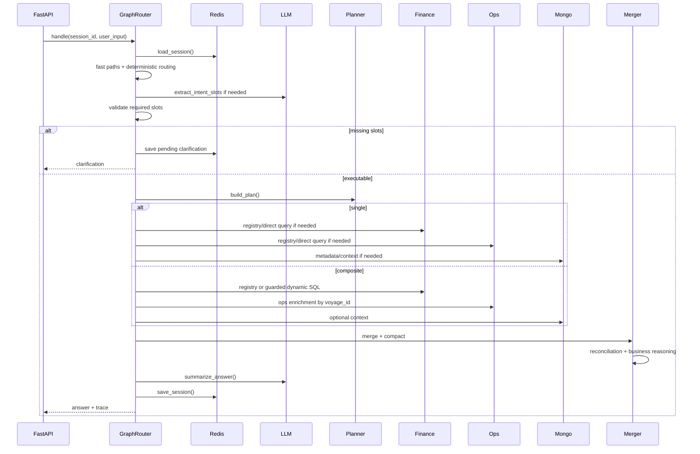

# Low-Level Design: Query Execution

This document focuses on the current query execution path from HTTP request to final answer.

---

## 1. Scope

Covered:

- `/query` request handling
- session and idempotency
- intent and slot extraction
- clarification
- planning
- single and composite execution
- finance/ops/mongo agents
- merge and compact payload
- source reconciliation
- business reasoning
- answer generation
- response, trace, and persistence

---

## 2. Request Entry

The frontend sends:

```http
POST /query
```

Payload:

```json
{
  "query": "Which voyages have high revenue but weak business quality?",
  "session_id": "customer-session",
  "request_id": "unique-request-id",
  "chat_history": []
}
```

FastAPI:

1. Creates session id if missing.
2. Checks idempotency if `request_id` is present.
3. Calls `router.handle(session_id, query)`.
4. Schedules query side effects in background tasks.
5. Returns `QueryResponse`.

---

## 3. Query Response Contract

Response:

```json
{
  "session_id": "customer-session",
  "answer": "...",
  "clarification": null,
  "trace": [],
  "intent_key": "analysis.high_revenue_low_pnl",
  "slots": {},
  "dynamic_sql_used": true,
  "dynamic_sql_agents": ["finance", "ops"]
}
```

If clarification is needed:

```json
{
  "answer": "",
  "clarification": "### Quick question ...",
  "intent_key": "vessel.summary",
  "slots": {}
}
```

---

## 4. Query Execution Sequence



---

## 5. Step 1: Session Load

Node:

`n_load_session`

Reads Redis session:

- stored slots
- last intent
- previous result set
- focus slots
- pending clarification
- clarification options
- turn count

If Redis is unavailable, `RedisStore` can fall back to in-memory storage depending on configuration/runtime behavior.

---

## 6. Step 2: Intent And Slot Extraction

Node:

`n_extract_intent`

Extraction order:

1. Incomplete-entity exact fast paths.
2. Simple voyage shortcut.
3. Pending clarification resolution.
4. Chitchat/out-of-scope handling.
5. Result-set follow-up fast paths.
6. Deterministic routing rules.
7. LLM extraction if deterministic routing is insufficient.
8. Slot sanitization and placeholder cleanup.

Output:

- `intent_key`
- `slots`
- trace event

Examples:

| Query | Expected behavior |
| --- | --- |
| `tell me about vessel` | `vessel.summary`, missing `vessel_name`, clarification |
| `tell me about vesssl` | typo variant, same vessel clarification |
| `tell me about voyage` | `voyage.summary`, missing `voyage_number`, clarification |
| `tell me about port` | `port.details`, missing `port_name`, clarification |
| `Which vessels are profitable but operationally risky?` | `ranking.vessels`, composite finance+ops |

---

## 7. Step 3: Slot Validation And Clarification

Node:

`n_validate_slots`

The router checks required slots from `INTENT_REGISTRY`.

Examples:

- `voyage.summary` requires `voyage_number`.
- `port.details` requires `port_name`.
- `vessel.summary` accepts `vessel_name` or `imo` and treats missing/placeholder values as missing.

If missing:

1. `n_make_clarification` builds a message.
2. Suggestions are fetched where possible.
3. Redis stores pending context.
4. Execution stops.

Clarification examples:

- "You asked about a vessel, but didn’t specify which one."
- "You asked about a voyage, but didn’t specify the voyage number."
- "You asked about a port, but didn’t specify which one."

---

## 8. Step 4: Planning

Node:

`n_plan`

Planner input:

- `intent_key`
- `slots`
- `user_input`
- `session_ctx`
- optional `force_composite`

Planner output:

```json
{
  "plan_type": "composite",
  "intent_key": "analysis.high_revenue_low_pnl",
  "steps": [
    {"agent": "finance", "operation": "dynamicSQL"},
    {"agent": "ops", "operation": "dynamicSQL"},
    {"agent": "llm", "operation": "merge"}
  ]
}
```

---

## 9. Step 5A: Single Execution

Node:

`n_run_single`

Used for:

- direct voyage summary
- direct vessel summary
- metadata lookup
- port details
- result-set follow-ups that can be answered directly
- out-of-scope templates

Typical behavior:

1. Select the relevant agent.
2. Run registry SQL or direct Mongo fetch.
3. Store result in state.
4. Either return directly or route to merge/summarize.

---

## 10. Step 5B: Composite Execution

Node:

`n_execute_step`

Composite steps run in a loop.

Typical analytics query:

1. Finance step:
   - registry SQL or dynamic SQL.
   - returns rows and voyage ids when row-level.

2. Ops step:
   - resolves `$finance.voyage_ids`.
   - fetches ports, cargo grades, delays, offhire, remarks by `voyage_id`.
   - skips when finance result is aggregate-only and self-contained.

3. Mongo step:
   - optional metadata/remarks enrichment where allowed.

4. Merge step:
   - deterministic merge and artifact preparation.

---

## 11. Finance Dynamic SQL Detail

Flow:

```text
question + intent + slots
  -> SQLGenerator.generate(agent="finance")
  -> LLMClient.generate_sql()
  -> sql_guard.validate_and_prepare_sql()
  -> PostgresAdapter.execute_dynamic_select()
```

Guarded properties:

- read-only
- allowed tables
- allowed columns
- required limit
- placeholder params
- invalid columns rejected
- dangerous patterns blocked

Finance dynamic SQL should use `finance_voyage_kpi` and only join ops when config/intent permits it. Finance/ops joins should use `f.voyage_id = o.voyage_id`.

---

## 12. Ops Dynamic SQL Detail

OpsAgent prefers canonical paths:

- if `voyage_ids` exists:
  - `SELECT ... FROM ops_voyage_summary WHERE voyage_id = ANY(%(voyage_ids)s)`

- if `voyage_number` exists:
  - resolve matching voyage id
  - rerun by voyage ids

- if vessel summary:
  - deterministic vessel ops summary

Only when canonical paths do not apply does it use guarded dynamic SQL.

Ops dynamic SQL is not allowed to include finance-only metrics such as PnL/revenue unless the finance agent is responsible for those values.

---

## 13. Mongo Execution Detail

Mongo paths:

1. Direct anchor fetch:
   - vessel by name/IMO
   - voyage by number/id

2. Full voyage context:
   - remarks
   - fixtures
   - route/legs
   - projected fields

3. Dynamic Mongo find:
   - LLM creates JSON spec
   - Mongo guard validates
   - MongoAdapter executes read-only find

---

## 14. Merge And Identity

The merge layer combines finance, ops, and Mongo context.

Primary identity:

- `voyage_id`

Display identity:

- `voyage_number`
- vessel name
- vessel IMO

Reason:

- `voyage_number` alone may not be safe across vessels or sources.

Output:

- `artifacts.merged_rows`
- coverage metadata
- dynamic SQL metadata
- source sections

---

## 15. Compact Payload

Function:

`compact_payload(merged)`

Purpose:

- reduce token size
- keep only decision-relevant fields
- avoid overwhelming the summarizer

Preserved:

- voyage/vessel identity
- PnL
- revenue
- total expense
- TCE
- commission
- margin
- cost ratio
- commission ratio
- offhire days
- delay reason
- ports
- cargo grades
- remarks
- source reconciliation
- business reasoning

Trimmed:

- large raw finance rows
- large raw ops rows
- large Mongo docs
- long remarks
- long port/cargo lists

---

## 16. Source Reconciliation

Function:

`reconcile_merged_row(row)`

Config:

`config/business_rules.yaml`

Checks fields such as:

- `voyage_id`
- `vessel_imo`
- `imo`
- `vessel_name`
- `voyage_number`

Result:

```json
{
  "status": "aligned",
  "severity": "info",
  "canonical_fields": {},
  "caveats": [],
  "matched_fields": [],
  "missing_or_single_source_fields": [],
  "mismatches": []
}
```

The answer prompt uses mismatch/blocking severity as a data caveat.

---

## 17. Business Reasoning

Function:

`enrich_row_with_business_reasoning(row)`

Config:

`config/business_rules.yaml`

Adds:

- derived metrics
- signals
- unavailable metrics

Example derived metrics:

- margin
- cost ratio
- commission ratio

Example signals:

- inefficient revenue
- loss-making
- delay exposure
- profitable but operationally risky
- weak business quality

---

## 18. Answer Generation

Function:

`LLMClient.summarize_answer(...)`

Inputs:

- question
- plan
- compacted merged data
- merged rows
- answer style flags
- business answer contract

Prompt:

`config/prompt_rules.yaml`

Rules:

- use only provided JSON
- prefer `data.artifacts.merged_rows`
- include relevant KPIs
- include margin/cost ratio when relevant
- use reasoning signals for impact
- mention source caveats when relevant
- avoid irrelevant missing-field caveats
- return readable markdown

---

## 19. Trace Output

Trace events may include:

- intent extraction
- planning
- composite step start
- composite step result
- resolved voyage ids
- generated SQL
- Mongo query spec
- token usage
- merge summary

Frontend diagnostics consume this trace to show how the answer was produced.

---

## 20. Persistence After Answer

After answer generation:

- Redis session is updated.
- last intent and slots are persisted.
- result-set memory can be saved for follow-ups.
- background tasks record metrics, audit, user query records, and execution history.
- idempotency response can be cached by request id.

---

## 21. Query Execution Examples

### Incomplete Vessel Query

Input:

```text
tell me about vesssl
```

Flow:

1. Incomplete-entity fast path recognizes typo variant.
2. Intent becomes `vessel.summary`.
3. No vessel name/IMO exists.
4. Router returns clarification with vessel suggestions.

### Business Quality Query

Input:

```text
Which voyages have high revenue but weak business quality?
```

Flow:

1. Intent extracted as business/finance analysis.
2. Planner chooses composite.
3. Finance retrieves high-revenue weak-quality candidates.
4. Ops enriches rows by `voyage_id`.
5. Merge builds `merged_rows`.
6. Business reasoning computes margin/cost ratio and weak-quality signals.
7. LLM explains why revenue alone is not enough.

### Profitable But Risky Vessel Query

Input:

```text
Which vessels are profitable but operationally risky?
```

Flow:

1. Routing avoids metadata-only path because finance/risk terms are present.
2. Intent becomes `ranking.vessels`.
3. Finance+ops aggregate by vessel.
4. Response includes PnL and delay/offhire risk context.

---

## 22. Failure Handling

Common handled cases:

- missing slots -> clarification
- generated SQL invalid -> guard failure/retry path where configured
- unsupported Mongo spec -> guard error
- zero rows from wrong single route -> composite escalation where safe
- Redis unavailable -> fallback behavior
- source mismatch -> reconciliation caveat
- empty payload -> configured fallback answer

---

## 23. LLD Summary

Low-level query execution is controlled by a graph:

1. Load session.
2. Extract intent and slots.
3. Validate or clarify.
4. Plan.
5. Execute agents.
6. Merge by `voyage_id`.
7. Reconcile sources.
8. Add business reasoning.
9. Compact payload.
10. Summarize through LLM.
11. Persist session and trace.
12. Return response.
