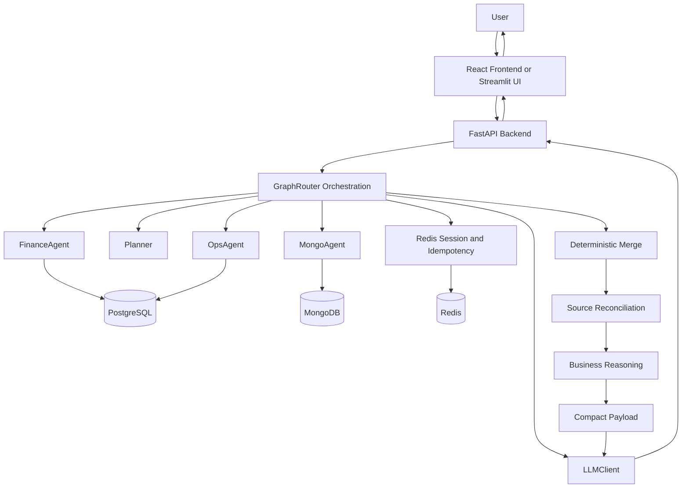
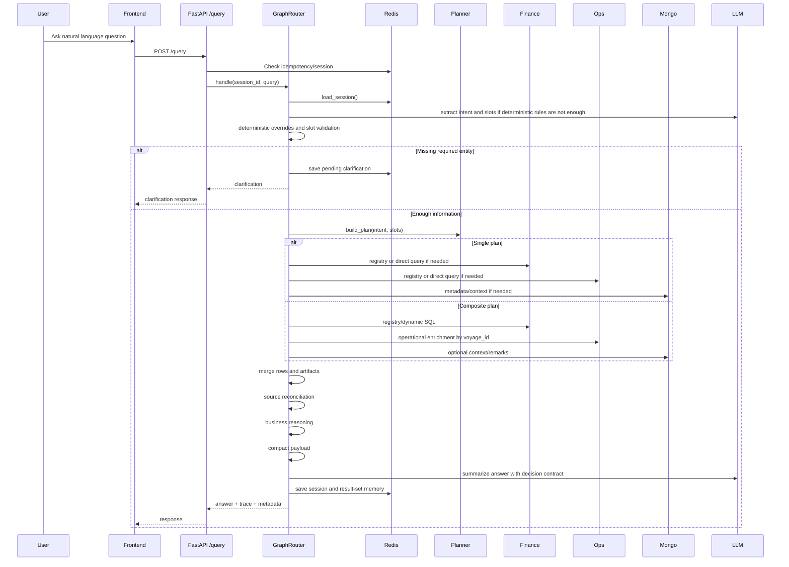

# KAI Agent Project Textbook

End-to-end technical understanding for interviews, demos, architecture walkthroughs, and future maintenance.

---

## 1. Executive Summary

KAI Agent is a multi-agent maritime analytics assistant. It lets a user ask natural-language business questions about voyages, vessels, ports, cargo grades, delays, offhire, PnL, revenue, cost, TCE, commissions, scenario comparison, and commercial quality.

The system is not a simple chatbot. It is a decision-support architecture that combines:

- A FastAPI backend for API, auth, admin, audit, and query execution.
- A React/Vite frontend for chat, login, admin diagnostics, and execution trace display.
- A Streamlit UI that can also be used as a lightweight technical/debug client.
- PostgreSQL for structured finance and operational analytics.
- MongoDB for richer voyage/vessel documents and metadata.
- Redis for session memory, idempotency, metrics, audit, and follow-up continuity.
- Groq-backed LLM calls for intent extraction, dynamic SQL generation, Mongo query generation, and answer summarization.
- Deterministic orchestration, SQL/Mongo guardrails, config-driven rules, source reconciliation, derived metrics, business reasoning signals, and golden validation.

The most important idea is:

> The LLM does not directly access databases. The LLM proposes or explains, while Python agents, adapters, validators, and config rules control execution.

---

## 2. What The System Answers

The assistant supports both operational and business questions.

Common query examples:

- "For voyage 2306, give an executive summary with PnL, revenue, expense, cargo grade, route, and remarks."
- "Which voyages have high revenue but weak business quality?"
- "Which vessels are profitable but operationally risky?"
- "Which cargo grades look attractive from a margin perspective?"
- "Compare ACTUAL vs WHEN_FIXED for voyages 1901, 1902, and 2301."
- "Which voyages had the most offhire days?"
- "Tell me about vessel Stena Conquest."
- "For port Singapore, rank voyages by PnL and show cargo grades."

The expected output is not only rows. A good answer includes:

- What happened.
- Why it matters.
- Business impact.
- Data caveats.
- Metrics such as PnL, revenue, margin, cost ratio, commission ratio, offhire days, and delay information when available.

---

## 3. High-Level Architecture



The runtime has seven conceptual layers:

1. Presentation layer: React/Vite frontend and optional Streamlit UI.
2. API layer: FastAPI routes, auth, admin, CORS, background side effects.
3. Orchestration layer: `GraphRouter`, LangGraph-style state machine, planner.
4. Agent layer: Finance, Ops, Mongo agents.
5. Data access layer: Postgres, Mongo, Redis adapters.
6. Guardrail/config layer: YAML rules, SQL guard, Mongo guard, prompt rules.
7. Intelligence layer: reconciliation, derived metrics, reasoning signals, LLM final answer.

---

## 4. Repository Map

Important backend folders:

| Path | Purpose |
| --- | --- |
| `app/main.py` | FastAPI entry point. Wires LLM, adapters, agents, router, API models, query endpoint, login/admin routes. |
| `app/orchestration/graph_router.py` | Main orchestration state machine. Loads session, extracts intent, validates slots, builds plan, executes agents, merges, summarizes. |
| `app/orchestration/planner.py` | Builds deterministic execution plans: `single` or `composite`. |
| `app/agents/finance_agent.py` | Finance analytics over Postgres. Supports registry SQL and guarded dynamic SQL. |
| `app/agents/ops_agent.py` | Operational analytics over Postgres: ports, grades, remarks, delays, offhire. |
| `app/agents/mongo_agent.py` | Mongo voyage/vessel metadata, rich documents, anchor resolution, dynamic find specs. |
| `app/adapters/postgres_adapter.py` | Safe Postgres execution for registry and dynamic SELECT queries. |
| `app/adapters/mongo_adapter.py` | Mongo read paths for voyages and vessels. |
| `app/adapters/redis_store.py` | Session memory, idempotency, locks, fallback memory mode. |
| `app/llm/llm_client.py` | Groq client, intent/slot extraction, SQL generation, summarization, answer polish. |
| `app/sql/sql_generator.py` | Builds SQL generation prompt using schema/rules. |
| `app/sql/sql_guard.py` | Validates and prepares generated SQL. |
| `app/sql/sql_allowlist.py` | Allowed tables/columns and forbidden SQL patterns. |
| `app/mongo/mongo_guard.py` | Validates generated Mongo specs. |
| `app/services/response_merger.py` | Compacts merged payload and preserves decision fields. |
| `app/services/business_reasoning.py` | Computes derived metrics and evaluates business signals from config. |
| `app/services/source_reconciliation.py` | Checks cross-source identity alignment and emits reliability metadata. |
| `app/config/*.py` | Loaders for YAML-driven rules and runtime config. |
| `app/registries/*.py` | YAML-backed intent and SQL registry facades. |

Important frontend folders:

| Path | Purpose |
| --- | --- |
| `frontend/digital-sales-agent-main/` | React/Vite frontend using TypeScript, Tailwind, shadcn-style components. |
| `frontend/digital-sales-agent-main/src/components/chat/AnalyticsChat.tsx` | Main chat component, API request, response rendering, execution trace UI. |
| `frontend/digital-sales-agent-main/src/pages/LoginPage.tsx` | Login flow. |
| `frontend/digital-sales-agent-main/src/pages/AdminPage.tsx` | Admin dashboard and diagnostics. |
| `app/UI/UX/streamlit_app.py` | Optional Streamlit chat/debug UI. |

Important config folders:

| Path | Purpose |
| --- | --- |
| `config/intent_registry.yaml` | Supported intents, needs, slots, aliases, SQL hints. |
| `config/sql_registry.yaml` | Named SQL templates. |
| `config/sql_rules.yaml` | SQL generation and validation rules. |
| `config/routing_rules.yaml` | Routing phrases, follow-up behavior, metadata/ranking terms, clarification rules. |
| `config/prompt_rules.yaml` | LLM answer generation, polish, out-of-scope, and SQL prompt rules. |
| `config/agent_rules.yaml` | Agent-specific limits and fallback SQL/prompt behavior. |
| `config/response_rules.yaml` | Payload compaction limits and labels. |
| `config/mongo_rules.yaml` | Mongo query/projection constraints. |
| `config/business_rules.yaml` | Derived metrics, reasoning signals, reconciliation policy, answer contract. |
| `config/schema.yaml` and `config/source_map.yaml` | Field/source metadata for routing and generation. |

---

## 5. Runtime Entry Points

### 5.1 FastAPI Backend

The backend starts in `app/main.py`.

It initializes:

- `LLMClient` using `GROQ_API_KEY`, `GROQ_MODEL`, and temperature.
- `MongoAdapter` and `MongoAgent`.
- `PostgresAdapter`, `FinanceAgent`, and `OpsAgent`.
- `RedisStore`.
- `GraphRouter`.

Main API models:

- `QueryRequest`: `query`, `session_id`, `request_id`, `chat_history`.
- `QueryResponse`: `session_id`, `answer`, `clarification`, `trace`, `intent_key`, `slots`, `dynamic_sql_used`, `dynamic_sql_agents`.

Important routes:

- `POST /query`: main assistant endpoint.
- Login/admin routes: used by the React UI for RBAC, metrics, audit log, users, and health.
- Session clear route: clears Redis/session state when testing.

The query endpoint also records metrics, audit, query history, and execution history. Recent performance work moved non-critical side effects into background tasks so user responses are not blocked by logging/metrics work.

### 5.2 React Frontend

The newer browser UI lives in `frontend/digital-sales-agent-main`.

It provides:

- Chat interface.
- Markdown rendering.
- Tables.
- Execution trace display.
- Login and admin pages.
- Diagnostics panels showing intent, route, agents, SQL, token usage, phases, and raw trace when available.

The chat component sends a request with:

- User query.
- Session id.
- Request id for idempotency.

It renders:

- `answer`.
- `clarification` when the backend asks for missing slot information.
- Trace and diagnostics.

### 5.3 Streamlit UI

`app/UI/UX/streamlit_app.py` is an older or technical UI that can still be useful for local testing and debugging.

It is simpler than the React UI, but useful for:

- Quick chat testing.
- Displaying trace.
- Running local demos without building the Vite app.

---

## 6. End-To-End Query Flow



Step-by-step:

1. User types a query in React or Streamlit.
2. Frontend calls `POST /query`.
3. FastAPI checks optional idempotency via `request_id`.
4. `GraphRouter.handle()` starts with session id and user input.
5. Router loads session context from Redis.
6. Router extracts intent and slots using deterministic rules plus LLM if needed.
7. Router validates required slots.
8. If a required slot is missing, it returns a clarification instead of querying databases.
9. If enough information exists, `Planner` builds a single or composite execution plan.
10. Agents query Postgres/Mongo through adapters.
11. Results are merged by identity, primarily `voyage_id`.
12. `response_merger.compact_payload()` produces a token-safe payload.
13. Each compact row is enriched with source reconciliation and business reasoning.
14. LLM generates the final answer using `prompt_rules.yaml`.
15. Session, trace, and side effects are persisted.
16. Frontend renders answer, clarification, trace, and diagnostics.

---

## 7. Single vs Composite Plans

### Single Plan

A single plan is used when the query is focused and direct.

Examples:

- "Tell me about vessel Stena Conquest."
- "What is the hire rate of vessel Elka Delphi?"
- "Show voyage 2306 remarks."
- "What is the operating status for this vessel?"

Characteristics:

- Usually one main source or one direct entity lookup.
- Lower latency.
- Uses registry SQL or deterministic Mongo lookup when possible.
- Good for entity summaries and metadata.

### Composite Plan

A composite plan is used for business analytics, rankings, comparisons, and multi-source synthesis.

Examples:

- "Which voyages have high revenue but weak business quality?"
- "Which vessels are profitable but operationally risky?"
- "Top voyages by PnL with cargo grades and ports."
- "Compare ACTUAL vs WHEN_FIXED for voyages 1901, 1902, 2301."

Typical composite steps:

1. Optional Mongo anchor resolution.
2. Finance query using registry SQL or guarded dynamic SQL.
3. Ops enrichment using `voyage_id`.
4. Optional Mongo remarks/context enrichment.
5. Deterministic merge.
6. LLM summarization.

---

## 8. Intent, Slots, And Clarification

The system converts natural language into:

- `intent_key`: what the user wants.
- `slots`: parameters needed to run the query.

Examples:

| User Query | Intent | Slots |
| --- | --- | --- |
| "Tell me about voyage 2306" | `voyage.summary` | `voyage_number=2306` |
| "Top 5 voyages by PnL" | `ranking.voyages_by_pnl` | `limit=5` |
| "For port Singapore, rank voyages by PnL" | port/ranking composite intent | `port_name=Singapore` |
| "Compare actual vs when-fixed for voyages 1901 and 1902" | `analysis.scenario_comparison` | `voyage_numbers=[1901,1902]` |

Clarification behavior:

- If user says "tell me about vessel" without a vessel name, the system should ask for the missing vessel.
- If user says "tell me about port" without a port name, the system should ask for a port.
- If user says "tell me about voyage" without a voyage number or id, the system should ask for a voyage identifier.

This behavior is config-driven through routing and prompt rules, not hardcoded as one-off answers.

---

## 9. Data Sources

### PostgreSQL

Postgres stores structured analytics tables:

- `finance_voyage_kpi`
  - `voyage_id`
  - `voyage_number`
  - `vessel_imo`
  - `scenario`
  - `revenue`
  - `total_expense`
  - `pnl`
  - `tce`
  - `total_commission`
  - dates and other finance fields

- `ops_voyage_summary`
  - `voyage_id`
  - `voyage_number`
  - `vessel_imo`
  - `vessel_name`
  - `module_type`
  - `is_delayed`
  - `delay_reason`
  - `offhire_days`
  - `ports_json`
  - `grades_json`
  - `remarks_json`

The current identity strategy is:

> Prefer `voyage_id` for finance/ops joins. Keep `voyage_number` as display/user-facing context.

This matters because voyage numbers may not be globally unique across vessels or sources.

### MongoDB

Mongo stores rich documents for voyages and vessels:

- Vessel metadata:
  - name
  - IMO
  - hire rate
  - scrubber
  - market type
  - contract history
  - operating status
  - consumption profiles

- Voyage metadata:
  - voyage id
  - voyage number
  - fixtures
  - remarks
  - cargo documents
  - routes/legs
  - projected results

Mongo is especially useful for metadata and document-style detail that does not fit cleanly into analytics tables.

### Redis

Redis is used for:

- Session memory.
- Follow-up context.
- Pending clarification context.
- Idempotency by `request_id`.
- Query metrics.
- Audit log.
- Execution history.

Redis lets the assistant understand follow-ups such as:

- "What about its remarks?"
- "Which one had the highest loss?"
- "Now show the same for Stena Superior."

---

## 10. Agent Responsibilities

### FinanceAgent

Primary responsibility:

- Finance KPIs from Postgres.

It handles:

- PnL rankings.
- Revenue rankings.
- Expense/cost analysis.
- Scenario comparisons.
- Cargo profitability.
- Vessel performance aggregates.
- High revenue but low/negative PnL queries.

It can run:

- Registry SQL from `config/sql_registry.yaml`.
- Dynamic SQL generated by LLM and validated by SQL guard.

### OpsAgent

Primary responsibility:

- Operational enrichment from Postgres.

It handles:

- Ports.
- Cargo grades.
- Delay flags.
- Delay reasons.
- Offhire days.
- Ops remarks.
- Voyage operational summaries.

For composite queries, OpsAgent often receives `voyage_ids` from FinanceAgent and fetches the matching operational rows.

### MongoAgent

Primary responsibility:

- Rich document and metadata retrieval from MongoDB.

It handles:

- Vessel lookup by name or IMO.
- Voyage lookup by number or id.
- Vessel metadata.
- Voyage metadata.
- Remarks and document-level context.
- LLM-built Mongo find specs after validation.

---

## 11. SQL Safety And Dynamic SQL

The system supports dynamic SQL because users ask flexible business questions. But generated SQL is not trusted blindly.

Flow:

1. SQLGenerator builds a schema-constrained prompt.
2. LLM returns SQL JSON.
3. SQL guard validates and repairs safe patterns.
4. PostgresAdapter executes only safe SELECT/WITH statements.

Safety rules include:

- Only allowed tables.
- Only allowed columns.
- No DML or destructive commands.
- No comments or suspicious patterns.
- LIMIT required.
- Bare hardcoded LIMIT blocked.
- Params must use `%(param)s` placeholders.
- Dynamic values must come from slots.
- SQL is capped by max rows.

Why this matters for interviews:

> This design uses LLMs for flexibility, but keeps execution deterministic, validated, and bounded.

---

## 12. Mongo Safety

Mongo dynamic find specs are also guarded.

Flow:

1. Mongo schema hint is sent to LLM.
2. LLM returns collection, filter, projection, sort, limit.
3. Mongo guard validates:
   - allowed collection
   - allowed operators
   - projection shape
   - limit bounds
4. MongoAdapter executes read-only query.

This prevents the LLM from inventing unsupported collections/operators or fetching unbounded documents.

---

## 13. Configuration-Driven Architecture

A major implementation goal was to move domain policy out of Python and into YAML configs.

This does not mean "no config contains domain knowledge." It means:

- Python is the generic execution engine.
- YAML owns business/domain policy.
- Loaders expose config to Python.
- Tests verify that config-driven behavior stays stable.

Examples:

| Concern | Config |
| --- | --- |
| Intent definitions | `intent_registry.yaml` |
| SQL templates | `sql_registry.yaml` |
| SQL validation/generation rules | `sql_rules.yaml` |
| Routing phrases and follow-up behavior | `routing_rules.yaml` |
| Answer generation and polish prompts | `prompt_rules.yaml` |
| Agent limits and fallback rules | `agent_rules.yaml` |
| Response compaction limits | `response_rules.yaml` |
| Mongo query/projection rules | `mongo_rules.yaml` |
| Derived metrics and reasoning signals | `business_rules.yaml` |

What remains in Python:

- Generic orchestration.
- Generic validation.
- Generic rule execution.
- Generic data access.
- Generic compaction and enrichment.

This is a good interview point:

> We did not remove all knowledge from the system. We moved business knowledge into versioned, testable configuration and kept Python as a reusable rule executor.

---

## 14. Business Decision Intelligence Layer

The latest upgrade added a decision-grade reasoning layer.

Before:

- The system could retrieve rich data.
- It could rank voyages/vessels/cargo.
- But answers could feel like data dumps or simple rankings.

After:

- Rows are enriched with derived metrics.
- Reasoning signals are evaluated from config.
- Source reliability is included.
- Prompts enforce a decision-grade answer contract.

### 14.1 Derived Metrics

Defined in `config/business_rules.yaml`.

Current examples:

- `margin = pnl / revenue`
- `cost_ratio = total_expense / revenue`
- `commission_ratio = total_commission / revenue`

These are computed generically by `app/services/business_reasoning.py`.

### 14.2 Reasoning Signals

Signals are config-defined conditions that explain business meaning.

Examples:

- `inefficient_revenue`
  - Revenue exists, margin is low, cost ratio is high.
  - Meaning: revenue is not converting efficiently into profit.

- `strong_margin`
  - Margin is strong relative to revenue.
  - Meaning: commercial conversion is good.

- `loss_making`
  - PnL is negative.
  - Meaning: voyage/group lost money.

- `delay_exposure`
  - Offhire or delay is present.
  - Meaning: operational risk exists.

- `profitable_but_operationally_risky`
  - PnL is positive but offhire/delay signals exist.
  - Meaning: good commercial result but operational risk needs review.

- `weak_business_quality`
  - Revenue exists but PnL/margin/cost conversion is weak.
  - Meaning: high revenue alone is not enough.

The evaluator supports:

- `all` condition groups.
- `any` condition groups.
- numeric comparisons.
- boolean checks.
- existence checks.
- field-to-field comparisons.

### 14.3 Source Reconciliation

Defined in `business_rules.yaml`, executed by `source_reconciliation.py`.

It checks whether sources agree on identity fields such as:

- `voyage_id`
- `vessel_imo`
- `imo`
- `vessel_name`
- `voyage_number`

It emits:

- `status`: aligned, partial, mismatch.
- `severity`: info, warning, blocking.
- `canonical_fields`: safest selected values.
- `caveats`: explanation of reliability.
- `mismatches`: exact source differences.

This prevents the answer from blindly trusting merged rows when sources disagree.

### 14.4 Decision Answer Contract

The prompt contract asks analytical answers to cover:

- What happened.
- Why it matters.
- Business impact.
- Data caveats.

The prompt also tells the model to use:

- `business_reasoning.signals`
- `business_reasoning.derived_metrics`
- `source_reconciliation`

as evidence.

---

## 15. Response Merge And Payload Compaction

The final LLM answer should see enough data to reason, but not a huge raw payload.

`response_merger.compact_payload()` does this.

It keeps:

- voyage id and voyage number
- vessel name and IMO
- PnL, revenue, expense, TCE, commission
- margin, cost ratio, commission ratio
- offhire days and delay reason
- ports and cargo grades, capped
- remarks, capped
- source reconciliation metadata
- business reasoning metadata

It drops or caps:

- huge raw arrays
- repeated finance/ops/mongo rows
- excessive remarks
- excessive port/cargo lists

This is important because:

- The LLM context stays smaller.
- The answer still has decision-grade facts.
- Token cost and latency are controlled.

---

## 16. Frontend Behavior

### React Chat

The main chat UI:

- Sends `query`, `session_id`, and `request_id`.
- Shows the assistant answer.
- Displays clarification if backend returns `clarification`.
- Shows execution trace/admin diagnostics.
- Renders markdown tables.
- Shows agents, phases, route, intent, SQL generation, and token information when available.

Recent clarification fix:

- The UI now prioritizes `data.clarification` when present.
- This avoids blank answers for incomplete questions like "tell me about vessel."

### Admin UI

The React app also has admin views for:

- metrics
- users
- audit logs
- system health

These call FastAPI admin endpoints with session/role checks.

---

## 17. Testing And Validation

The system uses several layers of validation.

### Unit Tests

Examples:

- SQL registry loader tests.
- Routing rules loader tests.
- Prompt rules loader tests.
- SQL guard tests.
- Mongo guard tests.
- Business reasoning tests.
- Source reconciliation tests.
- Response merger tests.
- Golden suite structure tests.

Recent full backend result:

```text
106 passed, 1 warning
```

### Golden Suite

The golden suite lives in:

`scripts/golden_config_suite.json`

The runner is:

`scripts/run_golden_config_suite.py`

It supports:

- capture
- compare
- category filtering
- id filtering
- isolated session suffixes
- `must_contain` checks
- `bad_phrases` checks
- trace summaries

Important categories include:

- core
- sql_aggregation
- voyage_metadata
- vessel_metadata
- vessel_ranking
- followup
- business_decision

The new `business_decision` category validates decision-quality queries such as:

- commercially inefficient voyages
- profitable but operationally risky vessels
- attractive cargo grades
- high revenue but weak business quality
- repeatable customer/charterer relationships

### Frontend Tests

The React app has Vitest setup and a basic test suite. It can be run with:

```powershell
npm test -- --run
```

from `frontend/digital-sales-agent-main`.

---

## 18. Deployment And Containerization

The app has Podman-ready containerization under `docker/`.

Important files:

- `docker/Containerfile.api`
- `docker/Containerfile.ui`
- `docker/podman-compose.app.yaml`
- `docker/app.podman.env.example`

The app layer connects to existing containers:

- Postgres container: `postgresdb`
- Mongo container: `mongodb`
- Redis container: `redisdb`
- Shared network: `kai-agent_kai-net`

Default host ports from the Podman doc:

- API: `8001 -> 8000`
- UI: `8501 -> 8501`

Useful commands:

```powershell
podman build -t kai-agent-api -f docker/Containerfile.api .
podman build -t kai-agent-ui -f docker/Containerfile.ui .
podman-compose -f docker/podman-compose.app.yaml --env-file docker/app.podman.env up -d --build
```

Verify:

```powershell
podman ps
podman logs kai-agent-api
podman logs kai-agent-ui
```

---

## 19. Observability And Debugging

Every response can include a trace.

Trace usually includes:

- intent extraction phase
- selected intent
- slots
- planning result
- composite step start/result
- finance/ops/mongo agents used
- generated SQL when dynamic SQL is used
- row counts
- token usage estimates
- merge summary

This is critical for demos and debugging.

Example explanation:

> If a user asks "Which voyages have high revenue but weak business quality?", the trace shows how the router classified it, which plan was built, which SQL was generated, how many finance rows were returned, whether ops enrichment ran, and how the final answer was produced.

---

## 20. Demo Walkthrough Script

Use this flow in an interview/demo:

1. Start with the problem:
   - "Business users need to ask natural questions over maritime finance and operations data."

2. Explain the architecture:
   - "The frontend calls FastAPI. FastAPI delegates to GraphRouter. GraphRouter plans and executes through Finance, Ops, and Mongo agents."

3. Show a simple query:
   - "Tell me about voyage 2306."
   - Explain single/entity flow.

4. Show a business query:
   - "Which voyages have high revenue but weak business quality?"
   - Explain composite flow, finance SQL, ops enrichment, merge, margin/cost ratio, reasoning signals.

5. Show a risk query:
   - "Which vessels are profitable but operationally risky?"
   - Explain vessel aggregate, offhire/delay risk, finance plus ops.

6. Show clarification:
   - "Tell me about vessel."
   - Explain missing slot clarification.

7. Show trace:
   - intent
   - agents
   - SQL
   - row counts
   - dynamic SQL flag

8. Explain safety:
   - SQL guard.
   - Mongo guard.
   - LLM never directly accesses DB.

9. Explain config-driven design:
   - YAML owns domain rules.
   - Python executes generic policies.

10. Explain validation:
   - Pytest.
   - Golden suite.
   - Business decision golden category.

---

## 21. Interview Talking Points

### What is the project?

It is a multi-agent maritime analytics assistant that turns natural language into safe, validated, multi-source analytics across Postgres, MongoDB, Redis, and LLM summarization.

### Why multi-agent?

Because different data domains need different access patterns:

- FinanceAgent for numeric KPIs.
- OpsAgent for operational voyage context.
- MongoAgent for rich metadata/documents.

The router composes them when one answer needs multiple sources.

### Why not let the LLM query directly?

Because database access must be controlled. The LLM can propose intent, SQL, or wording, but Python validates and executes through adapters and guards.

### Why config-driven?

Because business/domain rules change often. YAML makes rules versioned, reviewable, testable, and easier to update without rewriting orchestration code.

### What makes it decision-grade?

The system now adds:

- derived metrics
- business signals
- source reconciliation
- caveats
- answer contract
- business golden tests

So answers explain business meaning instead of only listing rows.

### What was technically hard?

The hardest parts were:

- intent routing across many similar maritime questions
- safe dynamic SQL
- joining finance and ops correctly by identity
- preserving enough data for reasoning while keeping payload small
- handling follow-ups and clarifications
- preventing LLM hallucination
- validating answer quality with golden queries

---

## 22. Challenges Faced

### 22.1 Ambiguous User Queries

Users often ask incomplete questions:

- "tell me about vessel"
- "tell me about port"
- "tell me about voyage"

Challenge:

- The system should not guess.
- It should ask for the missing slot.

Solution:

- Config-driven incomplete-entity detection.
- Placeholder slot cleanup.
- Clarification state stored in Redis.
- Frontend clarification display fix.

### 22.2 Similar Intent Boundaries

Examples:

- "Which vessels are operating?" is metadata.
- "Which vessels are profitable but operationally risky?" is finance plus ops.

Challenge:

- The word "operational" can mean vessel status or business risk.

Solution:

- Routing config blocks metadata override when finance/risk terms such as PnL, profit, revenue, offhire, delay, risk, or business quality are present.

### 22.3 Dynamic SQL Safety

Challenge:

- Users can ask open-ended analytics questions.
- Hardcoding every SQL query is not scalable.
- But generated SQL can be unsafe or wrong.

Solution:

- Schema-constrained SQL generation.
- SQL allowlist.
- SQL guard.
- Required LIMIT.
- Param placeholders.
- No DML/destructive statements.
- Tests and golden suite.

### 22.4 Identity Correctness

Challenge:

- Finance and ops data can share `voyage_number`, but voyage number alone is not always a safe identity key.

Solution:

- Move finance/ops joins toward `voyage_id`.
- Keep `voyage_number` as display context.
- Add tests to prevent old join patterns from coming back.

### 22.5 Data Quality And Source Mismatch

Challenge:

- Different sources may disagree on vessel name, IMO, voyage number, or voyage id.

Solution:

- Source reconciliation layer.
- `aligned`, `partial`, `mismatch`.
- severity and caveats.
- canonical field policy.
- Answer prompt tells LLM to lower confidence on blocking mismatches.

### 22.6 Business Reasoning Quality

Challenge:

- Earlier answers could be data-rich but not business-aware.

Solution:

- Derived metrics.
- Config-driven reasoning signals.
- Answer contract.
- Business golden queries.

### 22.7 Payload Size And Latency

Challenge:

- Raw finance, ops, and Mongo payloads can be large.
- LLM context can become slow and expensive.

Solution:

- Compact payload.
- Cap ports, grades, remarks, raw rows.
- Preserve only decision fields.
- Move query side effects to background tasks.
- Cache suggestion lists for clarification.

### 22.8 Frontend/Backend Contract

Challenge:

- Backend may return clarification instead of answer.
- UI previously prioritized empty answer and hid clarification.

Solution:

- Frontend now prioritizes `clarification`.
- Trace display helps understand backend decisions.

---

## 23. Current Strengths

- Multi-source reasoning over Postgres, Mongo, Redis, and LLM.
- Safe dynamic SQL with guardrails.
- Config-driven routing, prompts, SQL, and business policy.
- Source reconciliation and caveat-aware answers.
- Business reasoning layer with derived metrics and signals.
- Golden validation including business decision queries.
- Execution trace for explainability.
- React UI plus admin diagnostics.
- Podman-ready app containerization.

---

## 24. Current Limitations And Honest Caveats

The system is now decision-grade, but not human-perfect.

Important limitations:

- LLM wording can still vary run to run.
- Some business quality checks depend on available data.
- Missing fields may produce caveats such as unavailable metrics.
- Golden tests validate important strings and behavior, but not every possible business judgment.
- Dynamic SQL is guarded, but generated analytical shape can still need more config tuning.
- Domain rules in YAML still need business review and iteration.

Good interview phrasing:

> The system is not claiming to replace an analyst. It is a governed decision-support layer that turns operational and financial data into explainable business insights, while preserving traceability and safety.

---

## 25. Useful Commands

Run backend:

```powershell
python -m uvicorn app.main:app --host 127.0.0.1 --port 8010
```

Run backend tests:

```powershell
python -m pytest -q
```

Run business golden capture:

```powershell
python scripts/run_golden_config_suite.py capture --category business_decision --base-url http://127.0.0.1:8010/query --output business_decision_current.json
```

Run full golden compare:

```powershell
python scripts/run_golden_config_suite.py compare --base-url http://127.0.0.1:8010/query --baseline scripts/golden_config_baseline.json --report golden_config_compare_report.json
```

Run React frontend:

```powershell
cd frontend/digital-sales-agent-main
npm install
npm run dev
```

Run React tests:

```powershell
cd frontend/digital-sales-agent-main
npm test -- --run
```

Run Streamlit UI:

```powershell
streamlit run app/UI/UX/streamlit_app.py
```

---

## 26. One-Minute Architecture Pitch

KAI Agent is a config-driven, multi-agent maritime analytics assistant. A user asks a natural-language question in the React UI. The FastAPI backend sends it to GraphRouter, which loads Redis session context, extracts intent and slots, validates missing information, and builds either a single or composite plan. FinanceAgent, OpsAgent, and MongoAgent retrieve data from Postgres and Mongo through guarded adapters. Dynamic SQL is allowed only after schema-constrained generation and SQL guard validation. Results are merged by voyage identity, enriched with source reconciliation and business reasoning, compacted for the LLM, and then summarized using a decision-grade answer contract. The final response includes not just data, but business impact, caveats, and traceability.

---

## 27. Thirty-Second Demo Pitch

This system answers maritime business questions, not just data lookups. For example, when asked "Which voyages have high revenue but weak business quality?", it queries finance KPIs, enriches with operations, computes margin and cost ratio, flags weak revenue conversion, checks source reliability, and explains why high revenue alone is not enough. The trace shows exactly which intent was selected, which agents ran, what SQL was generated, and how the answer was produced.

---

## 28. What We Implemented Recently

Recent major upgrades:

- Slot clarification restored for incomplete vessel, port, and voyage queries.
- Fast path and caching added for clarification suggestion performance.
- Query side effects moved to FastAPI background tasks.
- SQL registry and dynamic hints moved toward `voyage_id`-first identity.
- `business_rules.yaml` added for metrics, reasoning signals, reconciliation, and answer contract.
- `business_reasoning.py` added for generic metric/signal evaluation.
- `source_reconciliation.py` added for source reliability metadata.
- `response_merger.py` updated to preserve decision fields.
- `prompt_rules.yaml` strengthened for decision-grade answers.
- Business golden queries added under `business_decision`.
- Tests added for reasoning, reconciliation, response payload, SQL identity, and golden suite structure.

---

## 29. Final Mental Model

Think of the system as four engines working together:

1. Understanding engine:
   - intent extraction
   - slots
   - clarification
   - follow-up memory

2. Retrieval engine:
   - finance agent
   - ops agent
   - mongo agent
   - guarded SQL/Mongo

3. Reasoning engine:
   - merge
   - reconciliation
   - derived metrics
   - business signals

4. Communication engine:
   - compact payload
   - decision answer contract
   - markdown answer
   - trace/debug metadata

That is the core architecture to explain in any technical interview or demo.
