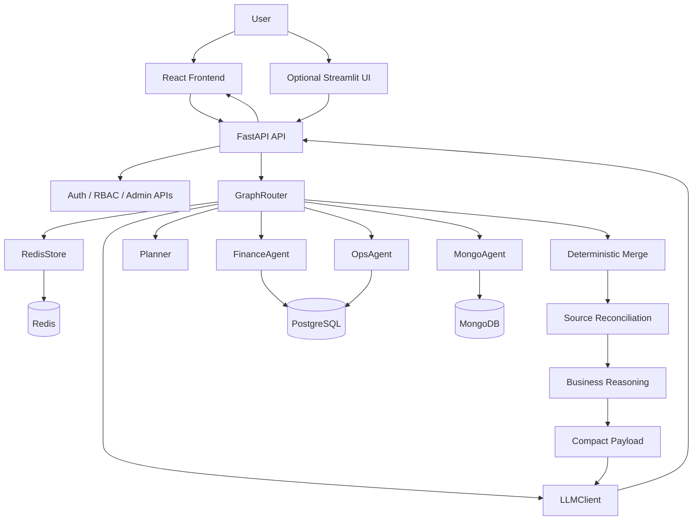
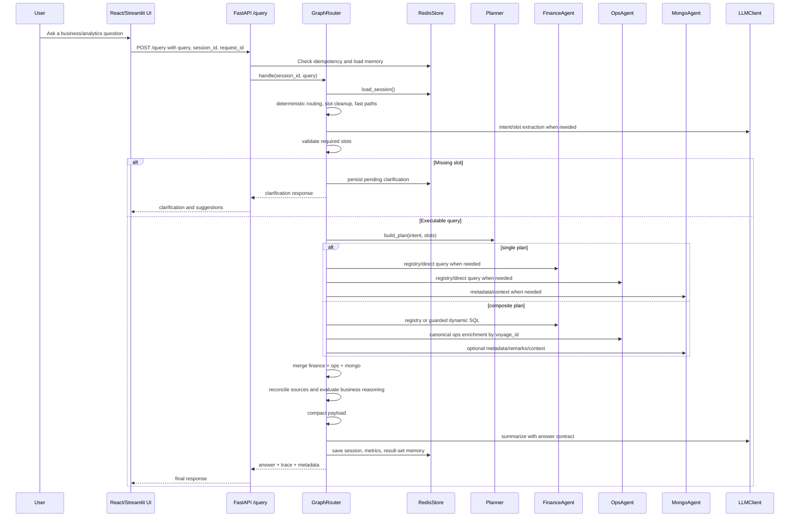

# KAI Agent Reference Architecture

This document describes the current implemented architecture of `kai-agent-amogh-fastapi`.
It supersedes older Streamlit-first and pre-business-reasoning architecture notes.

---

## 1. System Purpose

KAI Agent is a config-driven, multi-agent maritime analytics assistant. It answers natural-language questions about voyages, vessels, ports, cargo grades, financial KPIs, delays, offhire, scenario comparison, metadata, and business decision quality.

The current system is designed as a governed decision-support platform, not a free-form chatbot:

- Users ask questions in a React/Vite frontend or optional Streamlit UI.
- FastAPI exposes the main `/query` API plus auth/admin endpoints.
- `GraphRouter` orchestrates intent extraction, slot validation, planning, agent execution, merge, enrichment, and summarization.
- Agents retrieve data from PostgreSQL and MongoDB through safe adapters.
- Redis stores session memory, clarification state, metrics, audit, execution history, and idempotency data.
- YAML configuration owns most domain policy: routing, prompts, SQL rules, registry SQL, response compaction, and business reasoning.
- The LLM helps with intent extraction, dynamic SQL/spec generation, and answer wording, but it never directly accesses databases.

---

## 2. Current Runtime Stack

| Layer | Current implementation |
| --- | --- |
| Frontend | `frontend/digital-sales-agent-main` React/Vite app with chat, login, admin, diagnostics, markdown tables, and trace display |
| Optional UI | `app/UI/UX/streamlit_app.py` for local/debug chat |
| API | `app/main.py` FastAPI app |
| Orchestration | `app/orchestration/graph_router.py` and `planner.py` |
| Agents | `FinanceAgent`, `OpsAgent`, `MongoAgent` |
| Data | PostgreSQL, MongoDB, Redis |
| LLM | Groq-backed `LLMClient` |
| Guardrails | SQL allowlist/guard, Mongo guard, config loaders |
| Reasoning | source reconciliation, derived metrics, reasoning signals, answer contract |
| Validation | pytest and `scripts/run_golden_config_suite.py` |

---

## 3. High-Level Component View



---

## 4. End-To-End Request Flow



---

## 5. API Layer

`app/main.py` initializes the runtime and exposes the application API.

Important responsibilities:

- Load environment variables.
- Build `LLMClient`.
- Build `MongoAdapter`, `PostgresAdapter`, `RedisStore`.
- Build `MongoAgent`, `FinanceAgent`, `OpsAgent`.
- Build `GraphRouter`.
- Expose query, session, login, admin metrics, audit, users, and health endpoints.
- Use FastAPI background tasks for non-critical query side effects such as metrics/audit/execution-history recording.

Main request model:

```json
{
  "query": "Which voyages have high revenue but weak business quality?",
  "session_id": "customer-session-id",
  "request_id": "optional-idempotency-id",
  "chat_history": []
}
```

Main response fields:

- `session_id`
- `answer`
- `clarification`
- `trace`
- `intent_key`
- `slots`
- `dynamic_sql_used`
- `dynamic_sql_agents`

---

## 6. Frontend And RBAC

The current primary frontend is the React/Vite application under `frontend/digital-sales-agent-main`.

Important frontend responsibilities:

- Login page and role-aware access.
- Assistant chat page.
- Admin page for metrics, users, audit logs, and system health.
- Markdown answer rendering.
- Table rendering.
- Clarification display.
- Execution trace and diagnostics display.
- Stable session/request ids for continuity and idempotency.

FastAPI provides login/admin endpoints backed by `app/auth.py` and Redis/admin data helpers. Roles control which admin resources are available.

The Streamlit UI remains available as a developer/debug client, but the browser UI is now the richer product-facing interface.

---

## 7. Orchestration Layer

`GraphRouter` is the central orchestration engine.

It manages:

- session load
- intent and slot extraction
- slot validation
- clarification generation
- planning
- single execution
- composite execution
- result merge
- payload compaction
- business enrichment
- final summarization
- Redis persistence
- trace emission

The router is stateful per request through `GraphState`, not through global mutable query state.

Important `GraphState` fields:

- `session_id`
- `user_input`
- `raw_user_input`
- `session_ctx`
- `intent_key`
- `slots`
- `missing_keys`
- `clarification`
- `plan_type`
- `plan`
- `step_index`
- `mongo`
- `finance`
- `ops`
- `data`
- `merged`
- `answer`
- `artifacts`

`artifacts` carries transient execution details such as trace, merged rows, voyage ids, coverage, result-set memory, and dynamic SQL metadata.

---

## 8. Intent, Slots, And Clarification

The system maps user text to:

- `intent_key`: what the user wants.
- `slots`: parameters needed for execution.

The router uses:

- deterministic fast paths
- config-driven routing terms
- regex extraction
- LLM extraction when needed
- placeholder cleanup
- session-aware follow-up handling

Clarification is used when required information is missing. Examples:

- `tell me about vessel` asks for vessel name or IMO.
- `tell me about voyage` asks for voyage number.
- `tell me about port` asks for port name.
- Common typo/plural variants such as `tell me about vesssl`, `tell me about vessels`, `tell me about voyages`, and `tell me about voyge` also clarify.

Clarification context is saved in Redis so a short follow-up such as `2301` or `3` can resolve the pending slot and continue the original query.

---

## 9. Planner And Execution Modes

`Planner.build_plan()` is deterministic.

It chooses:

- `single` for direct entity or metadata queries.
- `composite` for fleet-wide rankings, aggregations, trends, comparisons, and business analytics.

Single examples:

- `voyage.summary`
- `vessel.summary`
- `voyage.metadata`
- `vessel.metadata`
- `port.details`

Composite examples:

- `ranking.*`
- `analysis.*`
- `aggregation.*`
- `ops.offhire_ranking`
- business decision queries

Composite execution usually follows:

1. Optional Mongo anchor resolution.
2. Finance query.
3. Ops enrichment by `voyage_id`.
4. Optional Mongo enrichment.
5. Deterministic merge.
6. LLM summarization.

---

## 10. Agents

### FinanceAgent

Uses PostgreSQL finance data, mainly `finance_voyage_kpi`.

Handles:

- PnL
- revenue
- total expense
- TCE
- commission
- voyage/vessel financial rankings
- scenario comparison
- high revenue with weak PnL
- business quality analytics

Execution modes:

- registry SQL from `config/sql_registry.yaml`
- guarded dynamic SQL through `SQLGenerator` and `sql_guard`

### OpsAgent

Uses PostgreSQL operational data, mainly `ops_voyage_summary`.

Handles:

- ports
- cargo grades
- offhire days
- delay status
- delay reason
- operational remarks
- vessel/voyage ops snapshots

In composite flows, it usually receives `voyage_ids` from finance and fetches matching operational context by `voyage_id`.

### MongoAgent

Uses MongoDB rich documents.

Handles:

- vessel metadata
- voyage metadata
- vessel and voyage anchor resolution
- remarks and fixture/context documents
- safe LLM-generated Mongo find specs

---

## 11. Data Identity Strategy

The current finance/ops identity strategy is:

> Prefer `voyage_id` for finance/ops joins. Keep `voyage_number` as display/user-facing context.

This avoids incorrectly merging rows when the same voyage number can appear across different vessels or sources.

`source_reconciliation.py` adds another safety layer by comparing identity fields across source sections and producing:

- `status`: aligned, partial, mismatch
- `severity`: info, warning, blocking
- `canonical_fields`
- `caveats`
- `mismatches`

---

## 12. Guardrails

Dynamic SQL and Mongo querying are allowed, but guarded.

SQL guardrails:

- only SELECT/WITH
- allowed tables and columns only
- forbidden DML/destructive patterns blocked
- LIMIT required
- bare hardcoded LIMIT blocked
- dynamic values use placeholders
- params filtered to SQL usage
- generated SQL repaired only through safe generic transforms

Mongo guardrails:

- allowed collections only
- allowed operators only
- projection required and bounded
- limit capped
- read-only find specs

The LLM proposes; guards and adapters execute.

---

## 13. Configuration-Driven Design

The current system is heavily config-driven.

| Config | Drives |
| --- | --- |
| `intent_registry.yaml` | intents, needs, slots, SQL hints |
| `sql_registry.yaml` | named SQL templates |
| `sql_rules.yaml` | SQL generation and guard policy |
| `routing_rules.yaml` | routing terms, follow-ups, clarification rules |
| `prompt_rules.yaml` | answer, polish, SQL, and out-of-scope prompts |
| `agent_rules.yaml` | agent caps, metrics, fallback SQL |
| `response_rules.yaml` | compaction limits and labels |
| `mongo_rules.yaml` | Mongo query behavior |
| `business_rules.yaml` | derived metrics, reasoning signals, reconciliation, answer contract |
| `schema.yaml` / `source_map.yaml` | field/source metadata |

Python acts as the generic execution engine. Domain/business policy lives in versioned YAML.

---

## 14. Business Decision Intelligence

The current system includes a business reasoning layer.

`business_rules.yaml` defines:

- derived metrics
- reasoning signals
- reconciliation policy
- answer contract

Derived metrics include:

- `margin = pnl / revenue`
- `cost_ratio = total_expense / revenue`
- `commission_ratio = total_commission / revenue`

Reasoning signals include:

- inefficient revenue
- strong margin
- loss-making result
- delay exposure
- profitable but operationally risky
- weak business quality
- attractive cargo margin

`business_reasoning.py` evaluates these rules generically. It supports:

- `all`
- `any`
- numeric comparisons
- boolean checks
- existence checks
- field-to-field comparisons

`prompt_rules.yaml` instructs analytical answers to cover:

- what happened
- why it matters
- business impact
- data caveats

---

## 15. Merge, Compaction, And Summarization

`response_merger.compact_payload()` keeps the summarization payload small while preserving decision-critical fields.

Preserved fields include:

- voyage identity
- vessel identity
- revenue
- total expense
- PnL
- TCE
- commission
- margin
- cost ratio
- commission ratio
- offhire days
- delay reason
- key ports
- cargo grades
- remarks
- source reconciliation
- business reasoning

The LLM receives compact, decision-ready evidence instead of raw database dumps.

---

## 16. Testing And Validation

Validation layers:

- unit tests for loaders, guards, routing, clarification, reasoning, reconciliation, merger
- full pytest backend suite
- frontend Vitest suite
- golden capture/compare suite

Golden suite:

- `scripts/golden_config_suite.json`
- `scripts/run_golden_config_suite.py`

Important categories:

- `core`
- `sql_aggregation`
- `voyage_metadata`
- `vessel_metadata`
- `vessel_ranking`
- `followup`
- `business_decision`

The `business_decision` category validates the new reasoning-oriented queries.

---

## 17. Deployment

Podman application containerization is documented in `docs/PODMAN_APP_CONTAINERIZATION.md`.

The app layer includes:

- `docker/Containerfile.api`
- `docker/Containerfile.ui`
- `docker/podman-compose.app.yaml`
- `docker/app.podman.env.example`

It connects to existing containers:

- `postgresdb`
- `mongodb`
- `redisdb`
- network `kai-agent_kai-net`

---

## 18. Current Architecture Summary

KAI Agent is now a config-driven, multi-agent, decision-grade maritime analytics system. The frontend sends a natural-language query to FastAPI. `GraphRouter` loads session context, extracts intent/slots, clarifies missing entities, builds a single or composite plan, executes finance/ops/mongo agents through guarded adapters, merges rows by safe identity, enriches with reconciliation and business reasoning, compacts the evidence, and asks the LLM to generate a decision-grade answer with impact and caveats.
